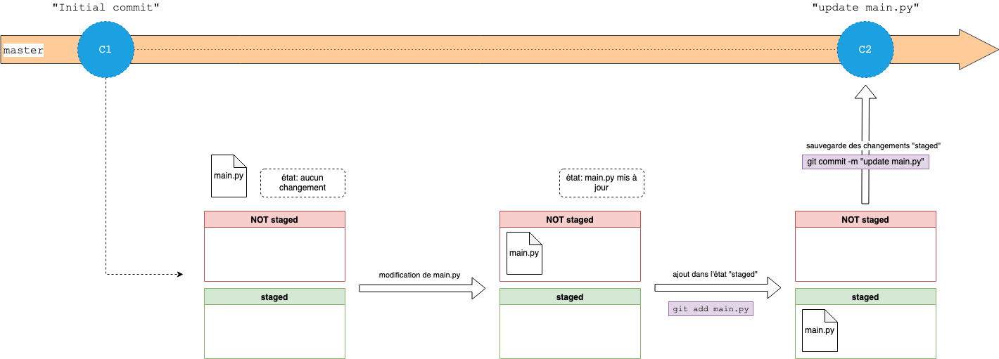

# 02 - Manipuler git

## Atelier 1 : Manipuler git individuellement

### Pré-requis

On se basera sur un simple script python.

Installation de :
- `git v2.32.0`
- `python v3.9`
- `VS Code` en option avec l'extension [Git Graph](https://marketplace.visualstudio.com/items?itemName=mhutchie.git-graph) d'installée.

Lancer la commande `python -m pip install -r atelier/requirements.txt` pour installer les dépendances pythons.

### Introduction

Dans cet atelier, on va utiliser les commandes basiques de git au sein d'un projet individuel. Ces commandes vous permettront de versionner votre code (et vos fichiers de manière générale), de lire votre historique et d'y naviguer, c'est-à-dire se déplacer d'une version ultérieure vers une version antérieure et vice-versa. L'exercice de l'atelier vous feront découvrir et manipuler les commandes git.

Pour cet atelier, les ressources suivantes peuvent vous être utile:
- [Cheatsheet Git](https://wac-cdn.atlassian.com/dam/jcr:e7e22f25-bba2-4ef1-a197-53f46b6df4a5/SWTM-2088_Atlassian-Git-Cheatsheet.pdf?cdnVersion=357)
- [GitEveryday](https://git-scm.com/docs/giteveryday#STANDALONE)

Pour rappel, le cheminement d'un commit



Un commit git "sauvegarde" uniquement les fichiers dans l'état **staged**.

### Exercice

Un script python est mis à votre disposition `atelier/main.py`. Ce fichier sera versionné à chaque ajout de fonctionnalité jusqu'à sa version finale.

- **État initial** : `atelier/main.py` afficher un message hello.
- **État final** : `atelier/main.py` analyse l'ensemble des fichiers contenu dans `atelier/rsc/`.

#### Partie 1 

1. **TODO**: Lancer la commande `git status`.

À ce stade, tout est *clean*. On va rajouter une fonctionnalité à notre programme afin de faire réagir git.

2. **TODO**: Copier-coller la fonction ci-dessous dans le fichier `atelier/main.py` (dans la section *Functions*)

```Python
def get_files_path(folder: str) -> List[Path[str]]:
    """Renvoie la liste des noms de fichier contenu dans {folder}
    
    Args:
        folder (str): chemin du dossier à parcourir

    Return:
        List[Path[str]]: liste contenant les chemins des fichiers de {folder}
    """
    return list(Path(folder).iterdir())
```

2. **TODO**: Lancer de nouveau la commande `git status`. Des changements ont du être opérés. 

Effectivement, le contenu du fichier `atelier/main.py` a changé, c'est ce que vous indique le résultat de la commande. Pour prendre en compte les changement, il faut les ajouter dans votre commit.

3. **TODO**: Ajouter les modifications dans l'état "staged" à l'aide de la commande `git add .` (`.` signifit "Tous les fichiers modifiées")
4. **TODO**: Lancer à nouveau `git status` et observer. Créer une sauvegarder (commit) avec la commande `git commit -m "<mon message expliquant les changements>"`. Exécuter de nouveau `git status`.

Pour consulter l'historique git de votre projet, c'est à dire tous les commits de votre branche actuelle (`atl1_actif`), on utilise la commande `git log`

Ou bien, si vous êtes sur VScode, observer l'évolution de votre historique avec **Git Graph**.

5. **TODO**: Créer le dossier `atelier/rsc/` et rajouter à l'intérieur au moins 1 fichier au format `.txt` et au moins 1 fichier au format `.csv`. Mettre du contenu random dans les fichiers rajoutés (ie. https://loremipsum.io/generator/).

6. **TODO**: Lancer `git status`. Quels changements remarquez-vous ? Les fichiers de `atelier/rsc/` seront-ils pris en compte si vous faîtes un `git commit -m "rajout des fichier"` ? Faites-en sorte d'inclure les nouveaux fichiers et créer un nouveau commit.

À ce stade, si vous faîtes un `git status`, tout doit être *clean*.

7. **TODO**: Rajouter la fonctionnalité suivante et répéter les commandes (utiles) git précédentes afin de créer un nouveau commit pour cette fonctionnalité :

```python
def get_file_content(path: Path[str]) -> str:
    """Renvoie le contenu d'un fichier
    
    Args:
        path (Path(str)): chemin du fichier à lire
    Return:
        (str): contenu du fichier
    """
    return open(path).read()
```

Consulter de nouveau votre historique git et vous devriez voir 4 commits au total (dont le plus ancien a pour auteur 'Rxinui').

8. **TODO**: Rajouter et completer la fonction suivante à l'aide des fonctions pythons, `get_files_path` et `get_file_content`.

```python
def analyze_files(folder: str) -> None:
    """Analyse les fichier contenu dans {folder}

    L'analyse déduit les informations suivantes:
        data["file"]: nom du fichier
        data["extension"]: extension du fichier
        data["chars"]: nombre de caractères dans le fichier
        data["lines"]: nombre de lignes dans le fichier

    Args:
        folder (str): chemin du dossier à analyser
    """
    data = dict.fromkeys(["file","extension","chars","lines"])
    paths = # TODO
    for path in paths:
        content = # TODO
        data["file"], data["extension"] = #  TODO see https://docs.python.org/3.9/library/pathlib.html#methods-and-properties
        data["chars"], data["lines"] = # TODO see https://docs.python.org/3.9/library/stdtypes.html#string-methods
        print(content,"-"*10,data,sep="\n",end="\n\n")
```

9. **TODO**: Créer un nouveau commit pour inclure la nouvelle fonctionnalité.

10. **TODO**: Mettre à jour le main program du fichier `atelier/main.py` de sorte à utiliser la fonction `analyze_files` sur le dossier `rsc/`. Exécuter le fichier python. Si le programme fonctionne sans problème, créer un nouveau commit avec comme message `"Version finale de main.py"`. Sinon, corriger les erreurs et re-tester.

Observer l'évolution de votre historique avec **Git Graph**.

#### Partie 2

À présent, vous possédez un historique git contenant plusieurs commits. Ces commits, considérés comme des points de sauvegardes dans votre historique, sont navigable. Vous pouvez ainsi revenir une version antérieure puis repartir sur une version ultérieure. 

**Attention**: lorsque vous revenez sur une version, vous êtes placé sur une branche dites détachée (detached branch) de votre historique actuel. Cela permet de ne pas casser votre ligne temporelle (comme dans les voyages dans le temps). En effet, sans cette branche détachée, vos modifications sur une version antérieure impactera toutes celles des versions ultérieures et se résulteront en conflits.

*Exemple d'un changement de version vers une ancienne version*

```
Note: switching to 'c5a2036951b25f153fb581db9bf67aa2d9592313'.

You are in 'detached HEAD' state. You can look around, make experimental
changes and commit them, and you can discard any commits you make in this
state without impacting any branches by switching back to a branch.

If you want to create a new branch to retain commits you create, you may
do so (now or later) by using -c with the switch command. Example:

  git switch -c <new-branch-name>

Or undo this operation with:

  git switch -

Turn off this advice by setting config variable advice.detachedHead to false

HEAD is now at c5a2036 Add a row
```

Comme expliqué dans l'exemple, vous devez effectuer un `git switch` qui déportera votre branche détachée sur une nouvelle branche. Ainsi, vous pourrez la fusionner avec votre branche par défaut pour appliquer les modifications.

1. **TODO**: À l'aide de ces explications et du [Cheatsheet Git](https://wac-cdn.atlassian.com/dam/jcr:e7e22f25-bba2-4ef1-a197-53f46b6df4a5/SWTM-2088_Atlassian-Git-Cheatsheet.pdf?cdnVersion=357), revenez sur votre commit qui implémente la méthode `get_file_content` et modifiez cette méthode de sorte à ce qu'elle lise uniquement la 1er ligne d'un fichier.

2. **TODO**: Enregistrer les modifications en créeant un nouveau commit (qui en résultera d'une *detached branch*) puis verifiez votre historique avec `git log` et `git status`. Que remarquez vous ?

3. **TODO**: Fusionner vos modifications sur la branche par défaut (principale) qui est `atl1_actif`. Il y a-t-il conflit ? Faites un `git status` et suivez les instructions indiquées.

4. **TODO**: Vérifier votre nouvel historique et tester de nouveau le programme `atelier/main.py`

### Remarques

- Parfois, vous verrez la commande suivante `git commit -a -m "mon message de commit"`. L'option `-a` est un raccourci à la commande `git add` **pour les fichiers qui ont été placés dans l'état staged au moins une fois**. Exemple :
    1. Création d'un fichier `f1.txt` puis `git add .` puis `git commit -m "ajout f1"` --> 1er commit contient l'ajout du fichier `f1.txt`
    2. Création d'un fichier `f2.txt` puis ajout de texte dans le fichier `f1.txt` puis `git commit -a -m "ajout f2 et update f1"` --> 2e commit contient la modification du fichier `f1.txt` **mais ne contient pas la création du fichier `f2.txt`** car il n'a jamais était ajouté dans l'état **staged** par la commande `git add .`.
- `git` est un outil de versionnage concu pour le développement. Cela dit, il est tout a fait possible d'utiliser git pour versionner des documents words, des powerpoints, etc... Cela vous permettra d'avoir un unique fichier et différentes version de ce dernier.
  
*That's all folks*